# 🚀 Job Intelligence Platform

## 🎥 Demo Video

Watch a quick walkthrough of the platform:

- YouTube: [https://youtu.be/Kz1wW5NHUGU](https://youtu.be/Kz1wW5NHUGU)

### 📘 Code Lab

Follow the step-by-step guided codelab to explore and deploy the platform:

- Code Lab: https://codelabs-preview.appspot.com/?file_id=1IdCTMyAI9XGI3dAA2c7xzAaLcEPnVPqmRHvpz3LJE48#6

## 🌐 Live Application URLs

**Frontend:** https://job-intelligence-frontend-97083220044.us-central1.run.app  
**Backend API:** https://job-intelligence-backend-97083220044.us-central1.run.app  
**Project:** job-intelligence-platform (97083220044) | **Region:** us-central1

## Recent Updates (2025-12-12)

- Frontend: Removed career advice example button
- Frontend: Preloaded jobs on page load
- Frontend: Timezone-aware greeting via `APP_TIMEZONE` (defaults to America/New_York).
- Frontend: Removed job card rendering from Home to avoid duplicate listings.
- Frontend: Advanced Analytics shows H-1B breakdown in table and tooltips:
  - ✅ Approved (`h1b_certified`), 📋 Total Filed (`h1b_applications`), 📊 Rate = (Approved / Filed) × 100.
- Backend: Company filter uses ILIKE for fuzzy matching
- Backend: Analytics filters exclude placeholder company names (Unknown/Confidential/N/A/etc.).
- Backend: `/analytics/visa-sponsors` now returns `h1b_applications` and `h1b_certified`.

### Updated Deploy Command (Frontend)

```bash
gcloud run deploy job-intelligence-frontend \
  --source . \
  --region us-central1 \
  --allow-unauthenticated \
  --timeout 300 \
  --memory 2Gi \
  --cpu 2 \
  --max-instances 10 \
  --set-env-vars BACKEND_URL=https://job-intelligence-backend-97083220044.us-central1.run.app,APP_TIMEZONE=America/New_York \
  --project job-intelligence-platform
```


> A comprehensive end-to-end AI-powered job search platform that scrapes 50K+ jobs, enriches them with H-1B visa data, and provides intelligent matching with natural language understanding.

[](https://cloud.google.com)
[](https://snowflake.com)
[](https://airflow.apache.org)
[](https://openai.com)

## 📋 Table of Contents
- [Overview](#-overview)
- [Features](#-features)
- [Architecture](#%EF%B8%8F-architecture)
- [Technology Stack](#-technology-stack)
- [Quick Start](#-quick-start)
- [Data Pipeline](#-data-pipeline)
- [AI Agents](#-ai-agents)
- [Deployment](#-deployment)
- [Configuration](#-configuration)
- [Cost Optimization](#-cost-optimization)
- [Troubleshooting](#-troubleshooting)


## 🎯 Overview

The Job Intelligence Platform is a production-ready system that automates the entire job discovery lifecycle:

1. **🔍 Scrapes** 50K+ jobs from Fortune 500 companies and specialized boards
2. **🔧 Transforms** raw data through a 6-stage DBT pipeline
3. **🧠 Enriches** with H-1B visa sponsorship data and AI embeddings
4. **💬 Powers** a conversational AI interface for natural language job search
5. **📊 Visualizes** trends, salaries, and company insights

**Live Demo**: [Frontend](https://job-intelligence-frontend-97083220044.us-central1.run.app) • [API Docs](https://job-intelligence-backend-97083220044.us-central1.run.app/docs)

## ✨ Features

### 🤖 AI-Powered Agents
- **Agent 1 (Filter)**: Converts natural language to SQL for complex queries
- **Agent 2 (Chat)**: Answers questions about jobs with data retrieval
- **Agent 3 (Match)**: Matches your resume to relevant jobs
- **Agent 4 (Analysis)**: Provides deep insights and trend analysis

### 📈 Data Collection
- **Fortune 500**: 8-worker HTTP scraper for 500 companies
- **Graduate Jobs**: Selenium-based Airtable scraper (21 categories)
- **Internships**: Specialized internship board scraper
- **H-1B Data**: USCIS LCA disclosure data (200K+ records)

### 🔄 Automated Pipeline
- **Scheduling**: Daily/weekly scrapes via Cloud Composer
- **Transformations**: DBT models for data quality
- **Real-time Logs**: No more silent failures
- **Error Handling**: Dual timeout protection (total + output)

### 💡 Smart Features
- Semantic search with OpenAI embeddings
- Salary range prediction and normalization
- Remote/hybrid/onsite classification
- Location parsing (city/state/country)
- Company insights and trends

## 🏗️ Architecture

### System Overview

```mermaid
graph TB
    Users[👥 Users]
    
    subgraph "Presentation Layer"
        Frontend[🎨 Streamlit Frontend<br/>Cloud Run<br/>2Gi RAM, 2 CPU]
    end
    
    subgraph "API Layer"
        Backend[⚡ FastAPI Backend<br/>Cloud Run<br/>4Gi RAM, 4 CPU]
        Agent1[🤖 SQL Generator<br/>Mistral-7B]
        Agent2[💬 Chat Agent<br/>GPT-4]
        Agent3[🎯 Resume Matcher<br/>Embeddings]
        Agent4[📊 Analytics Agent<br/>GPT-4]
    end
    
    subgraph "Data Warehouse - Snowflake"
        Raw[(📦 Raw Schema<br/>jobs_raw, h1b_lca_data)]
        Staging[(🔧 Staging Schema<br/>stg_jobs, dedup_jobs)]
        Processing[(⚙️ Processing Schema<br/>h1b_matched_jobs)]
        Marts[(✨ Marts Schema<br/>job_intelligence_mart)]
    end
    
    subgraph "Storage Layer"
        S3[☁️ AWS S3<br/>Raw JSON Files]
        GCS[☁️ GCS Bucket<br/>Code Artifacts]
    end
    
    subgraph "Orchestration - Cloud Composer (LARGE)"
        Composer[🎼 Apache Airflow 2.10.5<br/>2 CPU, 8GB RAM]
        DAG1[📋 Fortune 500 Scraper<br/>8 workers, 8hr]
        DAG2[🎓 Grad Jobs Scraper<br/>1 worker, 45min]
        DAG3[💼 Internship Scraper<br/>1 worker, 45min]
        DAG4[🔄 DBT Transformations<br/>6 models, 1hr]
        DAG5[🧠 Embeddings Generator<br/>OpenAI API]
    end
    
    subgraph "External Sources"
        F500[🏢 Fortune 500<br/>Career Pages]
        Airtable[📊 Airtable<br/>Job Boards]
        USCIS[🛂 USCIS<br/>H-1B Data]
    end
    
    Users --> Frontend
    Frontend --> Backend
    Backend --> Agent1
    Backend --> Agent2
    Backend --> Agent3
    Backend --> Agent4
    
    Agent1 --> Marts
    Agent2 --> Marts
    Agent3 --> Marts
    Agent4 --> Marts
    
    Composer --> DAG1
    Composer --> DAG2
    Composer --> DAG3
    Composer --> DAG4
    Composer --> DAG5
    
    DAG1 --> F500
    DAG2 --> Airtable
    DAG3 --> Airtable
    
    F500 -.->|Scrape| S3
    Airtable -.->|Scrape| S3
    USCIS -.->|Download| S3
    
    S3 --> Raw
    GCS --> Composer
    
    DAG4 --> Raw
    Raw --> Staging
    Staging --> Processing
    Processing --> Marts
    
    DAG5 --> Marts
    
    style Users fill:#e1f5ff
    style Frontend fill:#4CAF50
    style Backend fill:#2196F3
    style Composer fill:#FF9800
    style Marts fill:#9C27B0
    style S3 fill:#FF6F00
    style GCS fill:#4285F4
```



### Data Flow Pipeline


### Airflow DAG Dependencies


## 🛠 Technology Stack

### Frontend
- **Streamlit** 1.32+ - Interactive web UI
- **Plotly** - Data visualizations
- **Pandas** - Data manipulation

### Backend
- **FastAPI** 0.109+ - REST API framework
- **Mistral AI** - SQL generation (Mistral-7B)
- **OpenAI** - Embeddings & analysis (GPT-4, text-embedding-3-small)
- **Snowflake Connector** - Database client

### Data Pipeline
- **Apache Airflow** 2.10.5 - Workflow orchestration
- **DBT Core** 1.7.4 - Data transformations
- **Selenium** 4.16+ - Dynamic web scraping
- **BeautifulSoup4** - HTML parsing
- **Boto3** - AWS S3 client

### Infrastructure
- **Google Cloud Run** - Serverless containers
- **Google Cloud Composer** - Managed Airflow (LARGE: 2 CPU, 8GB RAM)
- **Snowflake** - Cloud data warehouse
- **Amazon S3** - Raw data storage
- **Google Cloud Storage** - Code artifacts

## 🚀 Quick Start

### Prerequisites
```bash
# Install required tools
brew install google-cloud-sdk python@3.11 docker

# Verify installations
gcloud --version
python3 --version
docker --version
```

### 1. Clone & Configure
```bash
# Clone repository
git clone <your-repo-url>
cd job-intelligence-platform

# Create secrets file
cp config/secrets.template secrets.json

# Edit secrets.json with your credentials:
# - Snowflake: account, user, password, warehouse
# - OpenAI: API key
# - AWS: access key, secret key, bucket
# - Airtable: API token
```

### 2. Deploy Backend
```bash
cd backend

# Deploy to Cloud Run
gcloud run deploy job-intelligence-backend \
  --source . \
  --platform managed \
  --region us-central1 \
  --allow-unauthenticated \
  --port 8000 \
  --memory 4Gi \
  --cpu 4 \
  --timeout 300

# Get backend URL
export BACKEND_URL=$(gcloud run services describe job-intelligence-backend \
  --region us-central1 \
  --format="value(status.url)")
```

### 3. Deploy Frontend
```bash
cd ../frontend

# Deploy to Cloud Run
gcloud run deploy job-intelligence-frontend \
  --source . \
  --platform managed \
  --region us-central1 \
  --allow-unauthenticated \
  --port 8501 \
  --memory 2Gi \
  --cpu 2 \
  --set-env-vars=BACKEND_URL=$BACKEND_URL

# Access frontend
gcloud run services describe job-intelligence-frontend \
  --region us-central1 \
  --format="value(status.url)"
```

### 4. Setup Cloud Composer
```bash
# Create LARGE environment (recommended)
gcloud composer environments create job-intel-airflow \
  --location us-central1 \
  --environment-size large \
  --image-version composer-2.16.0-airflow-2.10.5 \
  --service-account composer-airflow@PROJECT-ID.iam.gserviceaccount.com

# Enable error logging
gcloud composer environments update job-intel-airflow \
  --location us-central1 \
  --update-airflow-configs \
    webserver-expose_stacktrace=True,\
    webserver-expose_config=True,\
    logging-logging_level=INFO

# Upload DAGs and dependencies
cd ../airflow
./upload_to_composer.sh
```

### 5. Initialize Snowflake
```sql
-- Create database and schemas
CREATE DATABASE job_intelligence;
CREATE SCHEMA job_intelligence.raw;
CREATE SCHEMA job_intelligence.raw_staging;
CREATE SCHEMA job_intelligence.raw_processing;
CREATE SCHEMA job_intelligence.marts;

-- See snowflake/setup/ for complete DDL scripts
```

### 6. Run DBT
```bash
cd ../dbt

# Configure profiles
cp profiles.yml.template profiles.yml
# Edit profiles.yml with Snowflake credentials

# Test connection
dbt debug

# Run transformations
dbt run
```

## 📊 Data Pipeline

### DAG Schedule & Performance

| DAG | Schedule | Duration | Output | Workers | Resources |
|-----|----------|----------|--------|---------|-----------|
| **Fortune 500** | Weekly (Mon 1AM) | 2-4 hrs | 5K-10K jobs | 8 | HTTP-only |
| **Graduate Jobs** | Daily (2AM) | 30-45 min | 1K-2K jobs | 1 | Selenium |
| **Internships** | Daily (3AM) | 30-45 min | 500-1K jobs | 1 | Selenium |
| **DBT** | Daily (4AM) | 5-15 min | 6 models | - | SQL-only |
| **Embeddings** | Daily (5AM) | 20-40 min | Vectors | - | OpenAI API |

### DBT Transformation Flow

```sql
-- Stage 1: Raw to Staging
raw.jobs_raw 
  → stg_jobs (dedupe, clean, validate)

-- Stage 2: Deduplication  
stg_jobs
  → dedup_jobs (final unique records)

-- Stage 3: Enrichment
dedup_jobs + raw.h1b_lca_data
  → h1b_matched_jobs (visa sponsorship)

-- Stage 4: Final Mart
h1b_matched_jobs
  → job_intelligence_mart (analytics-ready)
```

### Error Handling & Monitoring

All DAGs include:
- ✅ **Real-time output streaming** (no silent hangs)
- ✅ **Dual timeout protection**:
  - Total timeout (Fortune 500: 8hr, Others: 45min, DBT: 1hr)
  - Output timeout (10min of silence triggers kill)
- ✅ **Full error tracebacks** in logs
- ✅ **Progress checkpoints** every N iterations
- ✅ **Automatic retries** (2x with 5min delay)

## 🤖 AI Agents

### Agent 1: Filter (SQL Generation)
```python
# Natural language → SQL
Input: "Find remote software engineering jobs paying over $150k"
Output: SELECT * FROM marts.job_intelligence_mart 
        WHERE title ILIKE '%software engineer%' 
          AND remote_flag = TRUE 
          AND salary_max > 150000
```

### Agent 2: Chat (Q&A)
```python
# Conversational queries
Input: "What companies sponsor H-1B visas for data scientists?"
Output: [Fetches data + generates natural language response]
```

### Agent 3: Match (Resume)
```python
# Resume → Job recommendations
Input: [Resume PDF/Text]
Output: Top 10 matching jobs with similarity scores
```

### Agent 4: Analysis (Insights)
```python
# Trend analysis
Input: "Analyze salary trends for ML engineers"
Output: [Statistical analysis + visualizations]
```

### Greeting Handler (Fast Path)
```python
# Instant responses for casual greetings
Patterns: "hey", "hello", "hi", "how are you"
Response: "Hey! 👋 How can I help you?" (no LLM)
```

## 🚀 Deployment

### Cloud Composer Sizes

| Size | CPU | RAM | Workers | Cost/Month | Best For |
|------|-----|-----|---------|------------|----------|
| **Small** | 0.5 | 2GB | 1 Selenium | $300-400 | Testing |
| **Medium** | 1 | 4GB | 2-3 Selenium | $600-800 | Light production |
| **Large** | 2 | 8GB | 5-6 Selenium | $1,200-1,500 | Heavy production |

**Recommendation**: LARGE for production (current setup)

### Upgrade/Downgrade
```bash
# Upgrade to LARGE
gcloud composer environments update job-intel-airflow \
  --location us-central1 \
  --environment-size large

# Takes 5-10 minutes, no data loss
```

### Manual DAG Trigger
```bash
# Via gcloud
gcloud composer environments run job-intel-airflow \
  --location us-central1 \
  dags trigger -- dag_fortune500_scraper

# Via Airflow UI
# 1. Navigate to DAG
# 2. Click ▶️ button
# 3. Confirm trigger
```

## ⚙️ Configuration

### Environment Variables

**Backend** (`backend/.env`):
```bash
SNOWFLAKE_ACCOUNT=your-account.snowflakecomputing.com
SNOWFLAKE_USER=your-user
SNOWFLAKE_PASSWORD=your-password
SNOWFLAKE_WAREHOUSE=COMPUTE_WH
SNOWFLAKE_DATABASE=job_intelligence
OPENAI_API_KEY=sk-...
MISTRAL_API_KEY=your-mistral-key
```

**Frontend** (`frontend/.env`):
```bash
BACKEND_URL=https://your-backend-url.run.app
```

### Airflow Config Overrides
```yaml
# Logging
logging-logging_level: INFO
webserver-expose_stacktrace: True
webserver-expose_config: True

# Performance
core-parallelism: 16
core-max_active_tasks_per_dag: 8
scheduler-max_tis_per_query: 512

# Workers
celery-worker_concurrency: 4
```

### DBT Profiles
```yaml
job_intelligence:
  outputs:
    prod:
      type: snowflake
      account: your-account
      user: your-user
      password: your-password
      role: ACCOUNTADMIN
      database: job_intelligence
      warehouse: COMPUTE_WH
      schema: raw
      threads: 8
  target: prod
```

## 💰 Cost Optimization

### Monthly Cost Breakdown (LARGE)
```
☁️  Cloud Composer (LARGE):     $1,200-1,500
🚀 Cloud Run (Frontend):        $5-10
🚀 Cloud Run (Backend):         $10-20
❄️  Snowflake (XS Warehouse):   $50-100
🤖 OpenAI API (Embeddings):     $20-50
📦 AWS S3 (Storage):            $5-10
📦 GCS (Artifacts):             $5-10
━━━━━━━━━━━━━━━━━━━━━━━━━━━━━━━━━━━━━━━
💵 Total:                       ~$1,300-1,700/month
```

### Optimization Tips

1. **Schedule wisely**: 
   - Fortune 500: Weekly (not daily)
   - Grad/Internship: Daily during active recruiting seasons only

2. **Auto-scaling**:
   ```sql
   -- Snowflake auto-suspend
   ALTER WAREHOUSE COMPUTE_WH 
   SET AUTO_SUSPEND = 300;  -- 5 minutes
   ```

3. **Batch operations**:
   - Generate embeddings for 1000s of jobs at once
   - Use OpenAI batch API for 50% cost reduction

4. **Caching**:
   ```python
   # Streamlit caching
   @st.cache_data(ttl=3600)
   def expensive_query():
       return snowflake_query()
   ```

5. **Right-size Composer**:
   - Use MEDIUM during slow periods
   - Upgrade to LARGE only for heavy scraping

## 🐛 Troubleshooting

### Common Issues

#### 1. Airflow Tasks Hanging Silently
**Symptom**: Task shows "running" but no logs for 10+ minutes

**Solution**: Fixed with dual timeout protection
```python
# All DAGs now have:
- signal.alarm(timeout_seconds)  # Total timeout
- select.select() monitoring      # Output timeout
```

#### 2. Selenium Scrapers Failing
**Symptom**: Chrome starts but scraper hangs

**Root Cause**: Insufficient resources for multiple Chrome instances

**Solution**:
- ✅ Upgraded to LARGE environment (2 CPU, 8GB RAM)
- ✅ Limited to 1 worker for Selenium DAGs
- ✅ Fortune 500 uses HTTP-only (8 workers safe)

#### 3. DBT Timeout After 10 Minutes
**Symptom**: DBT task fails at exactly 10 minutes

**Solution**: Added output monitoring
```python
# Kills if no output for 10 minutes
if time.time() - last_output_time > 600:
    process.kill()
```

#### 4. "Information Not Available" for Greetings
**Symptom**: Chatbot doesn't respond to "hey", "hello"

**Solution**: Added greeting detector
```python
# Fast-path before LLM
if question.lower() in ['hey', 'hello', 'hi']:
    return "Hey! 👋 How can I help you?"
```

### Log Access

**Composer Logs**:
```bash
# View in Cloud Console
gcloud composer environments describe job-intel-airflow \
  --location us-central1 \
  --format="get(config.airflowUri)"

# Or via Cloud Logging
gcloud logging read "resource.type=cloud_composer_environment"
```

**Cloud Run Logs**:
```bash
# Frontend
gcloud logging read "resource.labels.service_name=job-intelligence-frontend"

# Backend
gcloud logging read "resource.labels.service_name=job-intelligence-backend"
```

## 📚 Documentation

### Additional Docs
- [API Documentation](docs/api_documentation.md) - Complete endpoint reference
- [LLM Architecture](docs/LLM_ARCHITECTURE.md) - AI agent design patterns
- [H-1B Loading Guide](docs/h1b_loading_guide.md) - Visa data setup
- [System Status](docs/SYSTEM_STATUS.md) - Component health dashboard

### Key Endpoints

**Backend API** (`/docs` for Swagger):
```
GET  /api/jobs                 # List jobs with filters
POST /api/chat                 # Chat with AI agent
POST /api/match                # Resume matching
GET  /api/analytics/companies  # Company insights
GET  /api/analytics/trends     # Salary/location trends
```

## 🤝 Contributing

### Development Setup
```bash
# Create virtual environment
python3 -m venv venv
source venv/bin/activate

# Install dependencies
pip install -r requirements.txt

# Run locally
streamlit run frontend/Home.py
uvicorn backend.app.main:app --reload
```

### Code Style
- **Python**: Black formatter (line length 100)
- **SQL**: Lowercase keywords, 2-space indent
- **Commits**: Conventional commits (`feat:`, `fix:`, `docs:`)

## 📄 License

MIT License - See [LICENSE](LICENSE) file

## 🙏 Acknowledgments

- **OpenAI** - GPT-4 and text-embedding-3-small
- **Mistral AI** - Efficient SQL generation
- **Snowflake** - Cloud data warehouse
- **Google Cloud** - Infrastructure and managed services
- **Apache Airflow** - Workflow orchestration
- **DBT Labs** - Data transformation framework

---

**📅 Last Updated**: December 2025  
**📦 Version**: 2.0.0  
**🚀 Status**: Production (LARGE Environment)

---

<div align="center">
Made with ❤️ by Your Team
</div>

